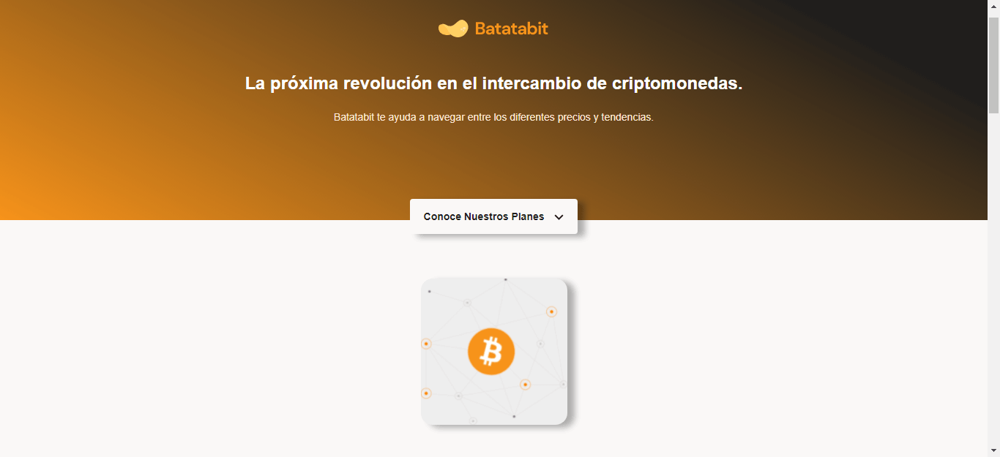

# Batatabit trading page

Una maquetación para un sitio de información y actualización en tiempo real de cripto-activos. Implementa una validación para tarjétas de crédito con el algorimo de Luhn. Un sitio totalmente responsivo, siguiendo la metodología mobile first
Tecnologías utilizadas: HTML, CSS, JavaScript, Figma, Git/Github.

## Comenzando 🚀

Al moverte a la sección de planes y elegir una opción, se va a desplegar un formulario que va a requerir tus datos para completar el pago (nombre, apellido, mes y año de emisión de la tarjeta, número de la tarjeta y dígitos de seguridad). En el campo de digitos de la tarjeta será lo que reciba el programa para validad su efectiva mente se trata o no de una tarjeta válida, y avisará con una pequeña ventana modal.

## Despliegue 📦

Pueder ver la página en esta url: https://dbriceno10.github.io/Daniel-proyecto-2-Curso-de-Responsive-Design-Maquetaci-n-Mobile-First/

